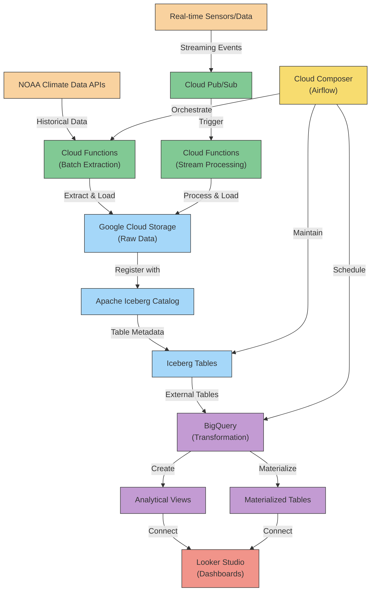
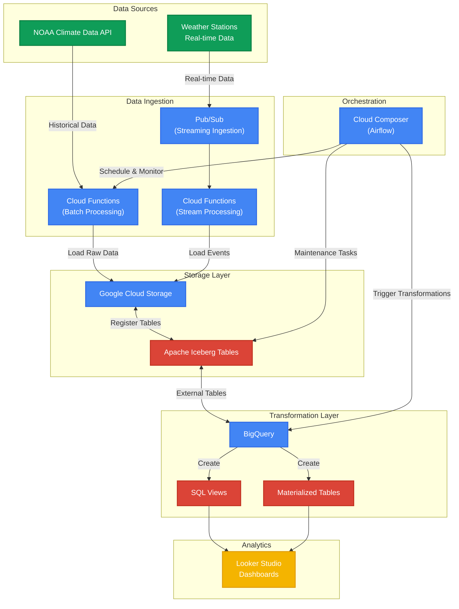

# Real-time Climate Data Analytics Platform with ELT

This project implements a modern data lake architecture using Apache Iceberg on Google Cloud Platform (GCP). The focus is on Extract-Load-Transform (ELT) rather than ETL, leveraging BigQuery's powerful transformation capabilities while maintaining data lake flexibility with Iceberg.

We'll use public climate data from NOAA to build a comprehensive data platform that showcases GCP services integration with Iceberg table format.

### Solution Architecture Diagram

Here's the architecture diagram for our ELT data lake solution:



The architecture diagram illustrates our complete ELT data lake solution with the following components:

1. Data Sources: NOAA Climate Data APIs for historical data and simulated real-time data sources
2. Extract Layer: Cloud Functions for batch extraction and Pub/Sub with Cloud Functions for streaming data
3. Load/Storage Layer: Raw data stored in Google Cloud Storage and registered with Apache Iceberg
4. Transform Layer: BigQuery accesses Iceberg tables to create analytical views and materialized tables
5. Orchestration: Cloud Composer (Airflow) coordinates all data processing activities
6. Analytics & Visualization: Looker Studio connects to BigQuery for dashboarding and data exploration

## Architecture Overview

The project architecture follows modern data lake patterns with an ELT approach:

1. Data Extraction: Pub/Sub for real-time data, Cloud Functions for batch extraction
2. Loading: Direct loading into GCS data lake with Apache Iceberg format
3. Transformation: BigQuery for in-place transformations
4. Query Engine: BigQuery for analytics
5. Orchestration: Cloud Composer (managed Airflow)

## Step 1: Set Up GCP Environment

First, we need to set up our Google Cloud Platform environment with all necessary services and permissions.

### Create a New GCP Project

```bash
# Install Google Cloud SDK if not already installed
# https://cloud.google.com/sdk/docs/install

# Initialize gcloud and create a new project
gcloud init
gcloud projects create climate-data-lake-iceberg --name="Climate Data Lake Iceberg"

# Set the newly created project as the current project
gcloud config set project climate-data-lake-iceberg
```

### Enable Required APIs

```bash
# Enable necessary GCP services
gcloud services enable storage-api.googleapis.com \
                       bigquery.googleapis.com \
                       pubsub.googleapis.com \
                       cloudfunctions.googleapis.com \
                       cloudscheduler.googleapis.com \
                       composer.googleapis.com \
                       dataflow.googleapis.com \
                       artifactregistry.googleapis.com
```

### Create Service Accounts

```bash
# Create service account for data operations
gcloud iam service-accounts create data-lake-sa \
    --description="Service account for data lake operations" \
    --display-name="Data Lake Service Account"

# Grant necessary permissions
gcloud projects add-iam-policy-binding climate-data-lake-iceberg \
    --member="serviceAccount:data-lake-sa@climate-data-lake-iceberg.iam.gserviceaccount.com" \
    --role="roles/storage.admin"

gcloud projects add-iam-policy-binding climate-data-lake-iceberg \
    --member="serviceAccount:data-lake-sa@climate-data-lake-iceberg.iam.gserviceaccount.com" \
    --role="roles/bigquery.admin"

gcloud projects add-iam-policy-binding climate-data-lake-iceberg \
    --member="serviceAccount:data-lake-sa@climate-data-lake-iceberg.iam.gserviceaccount.com" \
    --role="roles/pubsub.editor"
```

### Initialize Local Development Environment

```bash
# Create a virtual environment for Python development
python -m venv iceberg-env
source iceberg-env/bin/activate  # On Windows: iceberg-env\Scripts\activate

# Install required packages
pip install google-cloud-storage \
            google-cloud-bigquery \
            google-cloud-pubsub \
            google-cloud-functions \
            pyiceberg \
            pandas \
            pyarrow \
            apache-airflow \
            requests
```

## Step 2: Data Lake Storage Setup with Iceberg

In this step, we'll set up our GCS buckets and configure Apache Iceberg to work with GCS as the storage backend.

## Solution Architecture Diagram

Here's the solution architecture diagram showing the data flow and component interaction:



### Create GCS Buckets

```bash
# Create GCS buckets for the data lake zones
gcloud storage buckets create gs://climate-lake-raw-data \
    --location=us-central1 \
    --uniform-bucket-level-access

gcloud storage buckets create gs://climate-lake-iceberg-tables \
    --location=us-central1 \
    --uniform-bucket-level-access

# Create a bucket for the Iceberg catalog
gcloud storage buckets create gs://climate-lake-iceberg-catalog \
    --location=us-central1 \
    --uniform-bucket-level-access
```

### Configure Apache Iceberg

We'll set up a Python script to configure the Iceberg catalog and create our initial table schemas.

```python
# iceberg_setup.py - Part 1

from pyiceberg.catalog import load_catalog
import os

# Set environment variables
os.environ["GOOGLE_APPLICATION_CREDENTIALS"] = "path/to/service-account-key.json"

# Create a catalog configuration
catalog_config = {
    "type": "rest",
    "uri": "gs://climate-lake-iceberg-catalog",
    "warehouse": "gs://climate-lake-iceberg-tables",
    "credential": "gcp",
    "region": "us-central1"
}

# Load the catalog
iceberg_catalog = load_catalog("climate_catalog", **catalog_config)

# Create a namespace
iceberg_catalog.create_namespace("climate_data")
```

```python
# iceberg_setup.py - Part 2 (Schema definitions)

# Schema for weather stations metadata
stations_schema = {
    "type": "struct",
    "fields": [
        {"id": 1, "name": "station_id", "type": "string", "required": True},
        {"id": 2, "name": "name", "type": "string"},
        {"id": 3, "name": "latitude", "type": "double"},
        {"id": 4, "name": "longitude", "type": "double"},
        {"id": 5, "name": "elevation", "type": "double"},
        {"id": 6, "name": "country", "type": "string"},
        {"id": 7, "name": "state", "type": "string"},
        {"id": 8, "name": "first_year", "type": "int"},
        {"id": 9, "name": "last_year", "type": "int"}
    ]
}

# Schema for daily weather observations
observations_schema = {
    "type": "struct",
    "fields": [
        {"id": 1, "name": "station_id", "type": "string", "required": True},
        {"id": 2, "name": "date", "type": "date", "required": True},
        {"id": 3, "name": "element", "type": "string", "required": True},
        {"id": 4, "name": "value", "type": "double"},
        {"id": 5, "name": "measurement_flag", "type": "string"},
        {"id": 6, "name": "quality_flag", "type": "string"},
        {"id": 7, "name": "source_flag", "type": "string"},
        {"id": 8, "name": "observation_time", "type": "timestamp"}
    ]
}
```

```python
# iceberg_setup.py - Part 3 (Create tables)

# Create the tables
stations_table_properties = {
    "format-version": "2",
    "write.parquet.compression-codec": "zstd",
    "write.metadata.compression-codec": "gzip"
}

iceberg_catalog.create_table(
    identifier=("climate_data", "stations"),
    schema=stations_schema,
    properties=stations_table_properties
)

# Partitioning for the observations table by year and month for efficient queries
observations_partitioning = [
    {"name": "year", "transform": "year(date)"},
    {"name": "month", "transform": "month(date)"}
]

observations_table_properties = {
    "format-version": "2",
    "write.parquet.compression-codec": "zstd",
    "write.metadata.compression-codec": "gzip"
}

iceberg_catalog.create_table(
    identifier=("climate_data", "observations"),
    schema=observations_schema,
    partition_spec=observations_partitioning,
    properties=observations_table_properties
)

print("Iceberg tables created successfully!")
```

Execute the script to set up the Iceberg catalog and tables:

```bash
python iceberg_setup.py
```

This will create our Iceberg catalog and tables with appropriate schemas. The tables are designed with climate data in mind, with stations containing metadata about weather stations and observations containing the actual weather measurements.

## Step 3: Data Extraction and Loading Pipelines

In this step, we'll create two pipelines: one for batch extraction and loading of historical climate data, and another for simulating real-time data ingestion through Pub/Sub.

### Batch Extraction and Loading

First, let's create a Python script to download and load historical NOAA GHCN (Global Historical Climatology Network) data into our data lake.

```python
# batch_loader.py - Part 1

import os
import requests
import pandas as pd
import pyarrow as pa
import pyarrow.parquet as pq
from pyiceberg.catalog import load_catalog
from google.cloud import storage
import tempfile
import datetime
import time

# Set environment variables for authentication
os.environ["GOOGLE_APPLICATION_CREDENTIALS"] = "path/to/service-account-key.json"

# Constants
GHCN_STATIONS_URL = "https://www1.ncdc.noaa.gov/pub/data/ghcn/daily/ghcnd-stations.txt"
GHCN_DATA_URL = "https://www1.ncdc.noaa.gov/pub/data/ghcn/daily/by_year/"
RAW_BUCKET = "climate-lake-raw-data"

# Initialize GCS client
storage_client = storage.Client()

# Initialize Iceberg catalog
catalog_config = {
    "type": "rest",
    "uri": "gs://climate-lake-iceberg-catalog",
    "warehouse": "gs://climate-lake-iceberg-tables",
    "credential": "gcp",
    "region": "us-central1"
}

iceberg_catalog = load_catalog("climate_catalog", **catalog_config)
```

```python
# batch_loader.py - Part 2A (Helper functions)

def download_and_upload_to_gcs(url, bucket_name, blob_name):
    """Download data from URL and upload to GCS bucket"""
    print(f"Downloading {url}...")
    response = requests.get(url)
    response.raise_for_status()
    
    bucket = storage_client.bucket(bucket_name)
    blob = bucket.blob(blob_name)
    blob.upload_from_string(response.content)
    print(f"Uploaded to gs://{bucket_name}/{blob_name}")
    return response.content
```

```python
# batch_loader.py - Part 2B (Process stations data)

def process_stations_data():
    """Process GHCN stations data and load to Iceberg"""
    print("Processing stations data...")
    
    # Download stations data
    content = download_and_upload_to_gcs(
        GHCN_STATIONS_URL, 
        RAW_BUCKET, 
        "ghcn/stations/ghcnd-stations.txt"
    )
    
    # Parse fixed-width format
    # Format spec: https://www1.ncdc.noaa.gov/pub/data/ghcn/daily/readme.txt
    stations_data = []
    for line in content.decode('utf-8').splitlines():
        if len(line) < 85:  # Skip malformed lines
            continue
        
        stations_data.append({
            'station_id': line[0:11].strip(),
            'latitude': float(line[12:20].strip() or 0),
            'longitude': float(line[21:30].strip() or 0),
            'elevation': float(line[31:37].strip() or 0),
            'name': line[41:71].strip(),
            'country': line[38:40].strip(),
            'state': line[38:40].strip() if line[38:40].strip() == 'US' else '',
            'first_year': int(line[74:79].strip() or 0),
            'last_year': int(line[79:85].strip() or 0)
        })
```

```python
# batch_loader.py - Part 2C (Complete stations processing)

    # Create DataFrame
    df = pd.DataFrame(stations_data)
    
    # Get Iceberg table
    stations_table = iceberg_catalog.load_table("climate_data.stations")
    
    # Write to temporary Parquet file
    with tempfile.NamedTemporaryFile(suffix='.parquet') as tmp:
        table = pa.Table.from_pandas(df)
        pq.write_table(table, tmp.name)
        
        # Upload to GCS
        stations_blob_name = f"iceberg/stations/data/stations_{int(time.time())}.parquet"
        bucket = storage_client.bucket(RAW_BUCKET)
        blob = bucket.blob(stations_blob_name)
        blob.upload_from_filename(tmp.name)
    
    # Register data with Iceberg
    stations_table.append(f"gs://{RAW_BUCKET}/{stations_blob_name}")
    
    print(f"Loaded {len(df)} stations to Iceberg table")
    return df
```

```python
# batch_loader.py - Part 3A (Process observations)

def process_observations_data(year, stations_df=None):
    """Process GHCN observations data for a specific year and load to Iceberg"""
    print(f"Processing observations data for year {year}...")
    
    # Download year data
    url = f"{GHCN_DATA_URL}{year}.csv.gz"
    blob_name = f"ghcn/observations/by_year/{year}.csv.gz"
    
    try:
        content = download_and_upload_to_gcs(url, RAW_BUCKET, blob_name)
        print(f"Downloaded data for year {year}")
    except requests.exceptions.HTTPError as e:
        print(f"Error downloading data for year {year}: {e}")
        return None
    
    # If we got stations data as parameter, filter only for certain stations
    # This is helpful to limit the data volume for demonstration purposes
    filter_stations = stations_df is not None
    
    # Process the CSV data
    # Format: station_id,date,element,value,m-flag,q-flag,s-flag,obs-time
    # Example: USC00045721,20150101,PRCP,0,,,P,
    
    # Create a temporary directory for processing chunks
    with tempfile.TemporaryDirectory() as tmpdir:
        # Stream and process the gzipped CSV in chunks
        # For demonstration, we'll process just a subset of records
        max_records = 100000  # Limit for demonstration
        processed_records = 0
        chunk_size = 10000
        chunk_counter = 0
```

```python
# batch_loader.py - Part 3B (Process observations chunks)

        # Get Iceberg table
        observations_table = iceberg_catalog.load_table("climate_data.observations")
        
        # Process in chunks and write each chunk as a separate file
        parquet_files = []
        
        # In a real implementation, use a proper CSV parser with streaming
        # Here we'll simulate it with a simplified approach for demonstration
        import gzip
        import io
        import csv
        
        with gzip.open(io.BytesIO(content), 'rt') as f:
            reader = csv.reader(f)
            chunk_data = []
            
            for row in reader:
                if len(row) < 8:  # Skip malformed rows
                    continue
                    
                # Filter by stations if needed
                if filter_stations and row[0] not in stations_df['station_id'].values:
                    continue
                    
                # Parse and validate date format (YYYYMMDD)
                try:
                    date_str = row[1]
                    date_obj = datetime.date(int(date_str[0:4]), int(date_str[4:6]), int(date_str[6:8]))
                except (ValueError, IndexError):
                    continue
                
                # Add record to chunk
                chunk_data.append({
                    'station_id': row[0],
                    'date': date_obj,
                    'element': row[2],
                    'value': float(row[3]) / 10.0 if row[2] in ['TMIN', 'TMAX', 'TAVG', 'PRCP'] else float(row[3]),
                    'measurement_flag': row[4] if row[4] else None,
                    'quality_flag': row[5] if row[5] else None,
                    'source_flag': row[6] if row[6] else None,
                    'observation_time': row[7] if row[7] else None
                })
```

```python
# batch_loader.py - Part 3C (Complete observations processing)

                processed_records += 1
                
                # When chunk is full or we've reached the max records, write to parquet
                if len(chunk_data) >= chunk_size or processed_records >= max_records:
                    # Create dataframe from chunk
                    chunk_df = pd.DataFrame(chunk_data)
                    
                    # Write to parquet
                    parquet_file = os.path.join(tmpdir, f"chunk_{chunk_counter}.parquet")
                    table = pa.Table.from_pandas(chunk_df)
                    pq.write_table(table, parquet_file)
                    
                    # Upload to GCS
                    parquet_blob_name = f"iceberg/observations/data/year={year}/chunk_{chunk_counter}_{int(time.time())}.parquet"
                    bucket = storage_client.bucket(RAW_BUCKET)
                    blob = bucket.blob(parquet_blob_name)
                    blob.upload_from_filename(parquet_file)
                    parquet_files.append(f"gs://{RAW_BUCKET}/{parquet_blob_name}")
                    
                    # Reset for next chunk
                    chunk_data = []
                    chunk_counter += 1
                    
                # If we've reached max records, stop
                if processed_records >= max_records:
                    break
        
        # Register all parquet files with Iceberg
        if parquet_files:
            observations_table.append(parquet_files)
            print(f"Loaded {processed_records} observations to Iceberg table for year {year}")
        else:
            print(f"No observations were processed for year {year}")
        
        return processed_records
```

```python
# batch_loader.py - Part 4 (Main function)

def main():
    """Run the batch loader process"""
    # Load stations data
    stations_df = process_stations_data()
    
    # Process observations for recent years (for demonstration)
    # In production, you might load more years or have a scheduled process
    # that loads new data incrementally
    for year in range(2020, 2023):
        process_observations_data(year, stations_df)

if __name__ == "__main__":
    main()
```

We can now run this script to extract data from NOAA, load it into our raw GCS buckets, and register it with our Iceberg tables:

```bash
python batch_loader.py
```

### Cloud Function for Batch Processing

To make this more production-ready, we can wrap this in a Cloud Function that can be triggered on a schedule. Let's create a basic Cloud Function that runs our batch loader:

```python
# main.py (Cloud Function)

import functions_framework
from batch_loader import process_stations_data, process_observations_data
import datetime

@functions_framework.http
def climate_data_loader(request):
    """HTTP Cloud Function that triggers the climate data loading process.
    
    Args:
        request (flask.Request): HTTP request object
    Returns:
        The response text or any set of values that can be turned into a
        Response object using flask.make_response
    """
    request_json = request.get_json(silent=True)
    request_args = request.args
    
    # Check if specific year was provided
    year = None
    if request_json and 'year' in request_json:
        year = int(request_json['year'])
    elif request_args and 'year' in request_args:
        year = int(request_args['year'])
    else:
        # Default to previous year if not specified
        year = datetime.datetime.now().year - 1
    
    # Process stations data first
    stations_df = process_stations_data()
    
    # Process observations for the specified year
    processed_records = process_observations_data(year, stations_df)
    
    return f"Processed {processed_records} climate data records for year {year}."
```

We also need to create a requirements.txt file for the Cloud Function:

```
# requirements.txt

functions-framework==3.3.0
google-cloud-storage==2.8.0
pyiceberg==0.16.1
pandas==2.0.1
pyarrow==12.0.0
requests==2.31.0
```

We can deploy this Cloud Function using the gcloud command:

```bash
gcloud functions deploy climate-data-loader \
  --gen2 \
  --runtime=python310 \
  --region=us-central1 \
  --source=. \
  --entry-point=climate_data_loader \
  --trigger-http \
  --service-account=data-lake-sa@climate-data-lake-iceberg.iam.gserviceaccount.com \
  --timeout=540s \
  --memory=2048MB
```

### Cloud Scheduler for Automated Execution

Let's set up a Cloud Scheduler to trigger our function automatically. This will pull data daily from the NOAA API:

```bash
# Create a service account for the scheduler
gcloud iam service-accounts create scheduler-sa \
    --description="Service account for Cloud Scheduler" \
    --display-name="Cloud Scheduler Service Account"

# Grant necessary permissions
gcloud projects add-iam-policy-binding climate-data-lake-iceberg \
    --member="serviceAccount:scheduler-sa@climate-data-lake-iceberg.iam.gserviceaccount.com" \
    --role="roles/cloudfunctions.invoker"

# Create scheduler job for daily runs
gcloud scheduler jobs create http climate-data-daily-job \
    --schedule="0 2 * * *" \
    --uri="https://us-central1-climate-data-lake-iceberg.cloudfunctions.net/climate-data-loader" \
    --http-method=GET \
    --oidc-service-account-email="scheduler-sa@climate-data-lake-iceberg.iam.gserviceaccount.com" \
    --oidc-token-audience="https://us-central1-climate-data-lake-iceberg.cloudfunctions.net/climate-data-loader"
```

This scheduler will run our data load function every day at 2:00 AM UTC.

### Streaming Pipeline with Pub/Sub

Let's create a streaming pipeline to simulate real-time climate data ingestion. First, we'll set up a Pub/Sub topic:

```bash
# Create a Pub/Sub topic for climate data
gcloud pubsub topics create climate-data-stream
```

Now, let's create a Cloud Function that will be triggered when a message is published to this topic:

```python
# stream_processor.py - Part 1 (Imports and Setup)

import base64
import json
import functions_framework
import pandas as pd
import pyarrow as pa
import pyarrow.parquet as pq
import tempfile
import time
import os
from datetime import datetime
from google.cloud import storage
from pyiceberg.catalog import load_catalog

# Set environment variables for authentication
os.environ["GOOGLE_APPLICATION_CREDENTIALS"] = "path/to/service-account-key.json"

# Constants
RAW_BUCKET = "climate-lake-raw-data"

# Initialize GCS client
storage_client = storage.Client()

# Initialize Iceberg catalog
catalog_config = {
    "type": "rest",
    "uri": "gs://climate-lake-iceberg-catalog",
    "warehouse": "gs://climate-lake-iceberg-tables",
    "credential": "gcp",
    "region": "us-central1"
}

iceberg_catalog = load_catalog("climate_catalog", **catalog_config)
```

```python
# stream_processor.py - Part 2 (Function Implementation)

@functions_framework.cloud_event
def process_pubsub_message(cloud_event):
    """When a message is published to Pub/Sub, this function is triggered.
    The function processes the climate data and saves it to Iceberg.
    
    Args:
        cloud_event: The CloudEvent that triggered this function
    """
    # Get the message data
    pubsub_message = base64.b64decode(cloud_event.data["message"]["data"]).decode("utf-8")
    print(f"Received message: {pubsub_message}")
    
    try:
        # Parse the message as JSON
        message_data = json.loads(pubsub_message)
        
        # Create a DataFrame from the message
        df = pd.DataFrame([message_data])
        
        # Validate required fields
        required_fields = ['station_id', 'date', 'element', 'value']
        for field in required_fields:
            if field not in df.columns:
                raise ValueError(f"Required field '{field}' missing from message")
        
        # Convert date string to date object if needed
        if isinstance(df['date'].iloc[0], str):
            df['date'] = pd.to_datetime(df['date']).dt.date
```

```python
# stream_processor.py - Part 3 (Writing to Iceberg)
        
        # Get the Iceberg table
        observations_table = iceberg_catalog.load_table("climate_data.observations")
        
        # Write to temporary Parquet file
        with tempfile.NamedTemporaryFile(suffix='.parquet') as tmp:
            # Convert DataFrame to PyArrow Table and write to Parquet
            table = pa.Table.from_pandas(df)
            pq.write_table(table, tmp.name)
            
            # Generate blob name with correct partitioning
            # Extract year and month for partitioning
            if isinstance(df['date'].iloc[0], str):
                date_obj = datetime.strptime(df['date'].iloc[0], '%Y-%m-%d')
            else:
                date_obj = df['date'].iloc[0]
                
            year = date_obj.year
            month = date_obj.month
            
            # Create blob name with partitioning
            parquet_blob_name = f"iceberg/observations/data/year={year}/month={month}/stream_{int(time.time())}.parquet"
            
            # Upload to GCS
            bucket = storage_client.bucket(RAW_BUCKET)
            blob = bucket.blob(parquet_blob_name)
            blob.upload_from_filename(tmp.name)
            
            # Register with Iceberg
            observations_table.append(f"gs://{RAW_BUCKET}/{parquet_blob_name}")
            
            print(f"Successfully processed streaming record and wrote to Iceberg table")
            return "Success", 200
    
    except Exception as e:
        print(f"Error processing message: {str(e)}")
        return f"Error: {str(e)}", 500
```

Now we can deploy this Cloud Function with the following command:

```bash
gcloud functions deploy climate-data-stream-processor \
  --gen2 \
  --runtime=python310 \
  --region=us-central1 \
  --source=. \
  --entry-point=process_pubsub_message \
  --trigger-topic=climate-data-stream \
  --service-account=data-lake-sa@climate-data-lake-iceberg.iam.gserviceaccount.com \
  --timeout=60s \
  --memory=512MB
```

To test our streaming pipeline, we can publish a test message to the Pub/Sub topic:

```bash
# Create a test message file
cat > test_message.json << EOL
{
  "station_id": "USW00094728",
  "date": "2023-07-01",
  "element": "TMAX",
  "value": 32.5,
  "measurement_flag": "",
  "quality_flag": "",
  "source_flag": "S",
  "observation_time": "15:00"
}
EOL

# Publish the message to Pub/Sub
gcloud pubsub topics publish climate-data-stream --message="$(cat test_message.json)"
```

## Step 4: Transformation in BigQuery

Now that we have our data loading pipelines set up, let's implement the transformation layer in BigQuery. This is where the ELT approach differs from ETL - we'll transform the data after it's loaded.

### Connect BigQuery to Iceberg Tables

First, we need to create BigQuery external tables that connect to our Iceberg data:

```bash
# Create a BigQuery dataset for our climate data
bq mk --dataset climate_data_lake

# Create external connection to our Iceberg tables
bq mk --connection --location=us-central1 \
    --connection_type=CLOUD_RESOURCE \
    iceberg_connection

# Grant necessary permissions to the connection service account
CONNECTION_SA=$(bq show --format=json --connection climate_data_lake.iceberg_connection | jq -r '.cloudResource.serviceAccountId')

gcloud projects add-iam-policy-binding climate-data-lake-iceberg \
    --member="serviceAccount:${CONNECTION_SA}" \
    --role="roles/storage.objectViewer"

# Create external tables for Iceberg data
bq query --nouse_legacy_sql \
'CREATE EXTERNAL TABLE climate_data_lake.stations \
OPTIONS (
  format = "ICEBERG",
  uris = ["gs://climate-lake-iceberg-tables/climate_data/stations"],
  connection = "climate_data_lake.iceberg_connection"
)'

bq query --nouse_legacy_sql \
'CREATE EXTERNAL TABLE climate_data_lake.observations \
OPTIONS (
  format = "ICEBERG",
  uris = ["gs://climate-lake-iceberg-tables/climate_data/observations"],
  connection = "climate_data_lake.iceberg_connection"
)'
```

Now, we can create transformations and views on top of these tables to make the data more usable for analytics:

### Create Transformation Views

```sql
-- Create a view that pivots temperature and precipitation data for easier analysis
CREATE OR REPLACE VIEW climate_data_lake.daily_weather_summary AS
WITH temperature_data AS (
  SELECT
    station_id,
    date,
    MAX(CASE WHEN element = 'TMAX' THEN value END) AS max_temp_celsius,
    MAX(CASE WHEN element = 'TMIN' THEN value END) AS min_temp_celsius,
    MAX(CASE WHEN element = 'TAVG' THEN value END) AS avg_temp_celsius,
    MAX(CASE WHEN element = 'PRCP' THEN value END) AS precipitation_mm,
    MAX(CASE WHEN element = 'SNOW' THEN value END) AS snowfall_mm,
    MAX(CASE WHEN element = 'SNWD' THEN value END) AS snow_depth_mm
  FROM
    climate_data_lake.observations
  WHERE
    element IN ('TMAX', 'TMIN', 'TAVG', 'PRCP', 'SNOW', 'SNWD')
  GROUP BY
    station_id, date
)
SELECT
  t.*,
  s.name AS station_name,
  s.latitude,
  s.longitude,
  s.elevation,
  s.country,
  s.state
FROM
  temperature_data t
JOIN
  climate_data_lake.stations s
ON
  t.station_id = s.station_id;
```

Now, let's create a more specialized view for monthly climate summaries:

```sql
-- Create a monthly climate summary view
CREATE OR REPLACE VIEW climate_data_lake.monthly_climate_summary AS
SELECT
  station_id,
  station_name,
  country,
  state,
  latitude,
  longitude,
  EXTRACT(YEAR FROM date) AS year,
  EXTRACT(MONTH FROM date) AS month,
  AVG(max_temp_celsius) AS avg_max_temp,
  AVG(min_temp_celsius) AS avg_min_temp,
  AVG(avg_temp_celsius) AS avg_temp,
  MAX(max_temp_celsius) AS highest_max_temp,
  MIN(min_temp_celsius) AS lowest_min_temp,
  SUM(precipitation_mm) AS total_precipitation,
  COUNT(date) AS days_in_month
FROM
  climate_data_lake.daily_weather_summary
WHERE
  max_temp_celsius IS NOT NULL OR
  min_temp_celsius IS NOT NULL OR
  precipitation_mm IS NOT NULL
GROUP BY
  station_id, station_name, country, state, latitude, longitude, year, month
ORDER BY
  station_id, year, month;
```

Let's also create a materialized table for faster query performance on the most commonly accessed data:

```sql
-- Create a materialized table for commonly accessed data
CREATE OR REPLACE TABLE climate_data_lake.annual_climate_summary
PARTITION BY year
CLUSTER BY country, state
AS
SELECT
  station_id,
  station_name,
  country,
  state,
  latitude,
  longitude,
  year,
  AVG(avg_max_temp) AS yearly_avg_max_temp,
  AVG(avg_min_temp) AS yearly_avg_min_temp,
  AVG(avg_temp) AS yearly_avg_temp,
  MAX(highest_max_temp) AS yearly_highest_max_temp,
  MIN(lowest_min_temp) AS yearly_lowest_min_temp,
  SUM(total_precipitation) AS yearly_total_precipitation,
  SUM(days_in_month) AS days_with_data
FROM
  climate_data_lake.monthly_climate_summary
GROUP BY
  station_id, station_name, country, state, latitude, longitude, year
ORDER BY
  country, state, station_id, year;
```

### Create Scheduled Refresh Query

Now we'll set up a scheduled query to refresh our materialized table daily:

```bash
# Create a scheduled query to refresh the materialized table daily
bq query --nouse_legacy_sql \
'CREATE OR REPLACE MATERIALIZED VIEW climate_data_lake.annual_climate_summary_refresh
PARTITION BY year
CLUSTER BY country, state
AS
SELECT
  station_id,
  station_name,
  country,
  state,
  latitude,
  longitude,
  year,
  AVG(avg_max_temp) AS yearly_avg_max_temp,
  AVG(avg_min_temp) AS yearly_avg_min_temp,
  AVG(avg_temp) AS yearly_avg_temp,
  MAX(highest_max_temp) AS yearly_highest_max_temp,
  MIN(lowest_min_temp) AS yearly_lowest_min_temp,
  SUM(total_precipitation) AS yearly_total_precipitation,
  SUM(days_in_month) AS days_with_data
FROM
  climate_data_lake.monthly_climate_summary
GROUP BY
  station_id, station_name, country, state, latitude, longitude, year
ORDER BY
  country, state, station_id, year;'

# Set up a scheduled query to refresh daily at 3:00 AM
bq query --nouse_legacy_sql --destination_table=climate_data_lake.annual_climate_summary \
--schedule="every 24 hours" --replace=true \
'SELECT * FROM climate_data_lake.annual_climate_summary_refresh'
```

With these transformations, we've created a robust data pipeline that follows the ELT pattern:

1. Extract: Data is pulled from NOAA sources via batch and streaming methods
2. Load: Raw data is loaded directly into GCS and registered with Apache Iceberg
3. Transform: Data is transformed in BigQuery using SQL views and materialized tables

## Step 5: Orchestration with Cloud Composer

To orchestrate our entire data pipeline, we'll use Cloud Composer (GCP's managed Apache Airflow service). This will help us coordinate the batch data extraction, loading, and transformation processes.

### Create Cloud Composer Environment

```bash
# Create a Cloud Composer environment
gcloud composer environments create climate-data-orchestrator \
  --location us-central1 \
  --image-version composer-2.6.0-airflow-2.6.3 \
  --node-count 3 \
  --zone us-central1-a \
  --machine-type n1-standard-2 \
  --service-account data-lake-sa@climate-data-lake-iceberg.iam.gserviceaccount.com \
  --python-version 3.8
```

Now, let's create our DAG file to orchestrate the data pipeline:

```python
# climate_data_dag.py

from airflow import DAG
from airflow.operators.python import PythonOperator
from airflow.operators.bash import BashOperator
from airflow.providers.google.cloud.operators.bigquery import BigQueryExecuteQueryOperator
from airflow.providers.google.cloud.operators.functions import CloudFunctionInvokeOperator
from datetime import datetime, timedelta
import requests
import os
import json

# Define default arguments
default_args = {
    'owner': 'airflow',
    'depends_on_past': False,
    'email_on_failure': False,
    'email_on_retry': False,
    'retries': 1,
    'retry_delay': timedelta(minutes=5),
}

# Define DAG
with DAG(
    'climate_data_pipeline',
    default_args=default_args,
    description='Climate Data Lake ELT Pipeline',
    schedule_interval='0 1 * * *',  # Run daily at 1:00 AM UTC
    start_date=datetime(2023, 1, 1),
    catchup=False,
    tags=['climate', 'data-lake', 'iceberg'],
) as dag:

    # Task 1: Load Stations Data
    load_stations = CloudFunctionInvokeOperator(
        task_id='load_stations_data',
        function_id='climate-data-loader',
        location='us-central1',
        project_id='climate-data-lake-iceberg',
        data=json.dumps({'load_stations_only': True}),
    )

    # Task 2: Load Observations Data (for yesterday)
    yesterday = '{{ macros.ds_add(ds, -1) }}'
    load_observations = CloudFunctionInvokeOperator(
        task_id='load_observations_data',
        function_id='climate-data-loader',
        location='us-central1',
        project_id='climate-data-lake-iceberg',
        data=json.dumps({'year': '{{ execution_date.year }}', 'month': '{{ execution_date.month }}', 'day': '{{ execution_date.day }}'}),
    )
```

```python
    # Task 3: Run Data Quality Check on Iceberg Tables
    run_dq_check = BashOperator(
        task_id='run_data_quality_check',
        bash_command="""python -c 'from pyiceberg.catalog import load_catalog; 
        import os; 
        os.environ["GOOGLE_APPLICATION_CREDENTIALS"] = "/opt/airflow/dags/keys/service-account-key.json"; 
        catalog_config = {"type": "rest", "uri": "gs://climate-lake-iceberg-catalog", "warehouse": "gs://climate-lake-iceberg-tables", "credential": "gcp", "region": "us-central1"}; 
        iceberg_catalog = load_catalog("climate_catalog", **catalog_config); 
        stations_table = iceberg_catalog.load_table("climate_data.stations"); 
        observations_table = iceberg_catalog.load_table("climate_data.observations"); 
        print(f"Stations count: {stations_table.scan().to_arrow().num_rows}"); 
        print(f"Observations count: {observations_table.scan().to_arrow().num_rows}"); 
        '""",
    )
```

```python
    # Task 4: Refresh BigQuery Materialized View
    refresh_bigquery_view = BigQueryExecuteQueryOperator(
        task_id='refresh_bigquery_view',
        sql='SELECT * FROM climate_data_lake.annual_climate_summary_refresh',
        destination_dataset_table='climate-data-lake-iceberg:climate_data_lake.annual_climate_summary',
        write_disposition='WRITE_TRUNCATE',
        create_disposition='CREATE_IF_NEEDED',
        use_legacy_sql=False,
        location='us-central1',
    )
```

```python
    # Task 5: Perform Iceberg Maintenance (compaction)
    run_iceberg_maintenance = BashOperator(
        task_id='run_iceberg_maintenance',
        bash_command="""python -c 'from pyiceberg.catalog import load_catalog; 
        import os; 
        os.environ["GOOGLE_APPLICATION_CREDENTIALS"] = "/opt/airflow/dags/keys/service-account-key.json"; 
        catalog_config = {"type": "rest", "uri": "gs://climate-lake-iceberg-catalog", "warehouse": "gs://climate-lake-iceberg-tables", "credential": "gcp", "region": "us-central1"}; 
        iceberg_catalog = load_catalog("climate_catalog", **catalog_config); 
        stations_table = iceberg_catalog.load_table("climate_data.stations"); 
        observations_table = iceberg_catalog.load_table("climate_data.observations"); 
        stations_table.rewrite_data_files(); 
        observations_table.rewrite_data_files(); 
        '""",
    )
    
    # Define task dependencies
    load_stations >> load_observations >> run_dq_check >> refresh_bigquery_view >> run_iceberg_maintenance
```

Upload the DAG to Cloud Composer:

```bash
# Get the DAGs folder for the Cloud Composer environment
DAGS_FOLDER=$(gcloud composer environments describe climate-data-orchestrator \
  --location us-central1 \
  --format="get(config.dagGcsPrefix)")

# Upload the DAG
gcloud storage cp climate_data_dag.py ${DAGS_FOLDER}/
```

This Airflow DAG orchestrates our entire pipeline:

1. Load stations metadata from NOAA
2. Load observations data for the current execution date
3. Run data quality checks on the Iceberg tables
4. Refresh the BigQuery materialized views for analytics
5. Perform Iceberg table maintenance for optimal performance

## Step 6: Analytics and Visualization

Now that we have our data pipeline set up, we can create visualizations and analytics dashboards using Looker Studio (formerly Data Studio) connected to our BigQuery views.

### Connect Looker Studio to BigQuery

Follow these steps to create a dashboard in Looker Studio:

1. Go to Looker Studio: https://lookerstudio.google.com/
2. Click "Create" and select "Report"
3. Select "BigQuery" as the data source
4. Navigate to your project and select the climate_data_lake.monthly_climate_summary view
5. Click "Add to Report"

### Example Visualizations

Here are some example visualizations you can create using the climate data:

- Time Series Chart: Plot average temperature trends over time for specific locations
- Heatmap: Show temperature variations across different regions using a map visualization
- Bar Chart: Compare monthly precipitation totals across different years
- Gauge: Show current temperature compared to historical averages
- Scatter Plot: Analyze the relationship between temperature and precipitation

Example SQL query for creating a custom visualization in BigQuery:

```sql
-- Query for temperature anomaly visualization
WITH station_baselines AS (
  SELECT
    station_id,
    month,
    AVG(avg_temp) AS baseline_temp
  FROM
    climate_data_lake.monthly_climate_summary
  WHERE
    year BETWEEN 1980 AND 2010  -- Standard baseline period
  GROUP BY
    station_id, month
)

SELECT
  c.year,
  c.month,
  c.station_id,
  c.station_name,
  c.country,
  c.state,
  c.latitude,
  c.longitude,
  c.avg_temp,
  b.baseline_temp,
  c.avg_temp - b.baseline_temp AS temp_anomaly
FROM
  climate_data_lake.monthly_climate_summary c
JOIN
  station_baselines b
ON
  c.station_id = b.station_id AND c.month = b.month
WHERE
  c.year >= 2015
ORDER BY
  c.year, c.month, c.station_id;
```

## Conclusion

In this project, we've built a comprehensive ELT data lake solution using Apache Iceberg on Google Cloud Platform. Our implementation features:

- Modern ELT architecture that leverages BigQuery for transformations
- Apache Iceberg table format for ACID transactions and schema evolution
- Multiple data ingestion patterns (batch and streaming)
- Automated orchestration with Cloud Composer (Airflow)
- Analytics-ready views and materialized tables
- Visualization capabilities through Looker Studio

This project provides hands-on experience with several key data engineering concepts and technologies that are in high demand in the industry today. By working with public climate data, you've created a solution that can be extended for more complex analytics use cases or as a foundation for machine learning models.

To extend this project further, consider:

- Implementing data quality monitoring with Great Expectations
- Adding machine learning models for climate prediction
- Creating more sophisticated data transformations in dbt
- Implementing CI/CD for your data pipelines

## Solution Architecture Diagram

Here's the solution architecture diagram showing the data flow and component interaction:


## Public Datasets Information

This section provides detailed information about the public climate datasets used in this project.

### 1. Global Historical Climatology Network (GHCN)

The GHCN dataset provides daily climate observations from land surface stations across the globe.

- Direct download URL: https://www.ncdc.noaa.gov/data-access/land-based-station-data/land-based-datasets/global-historical-climatology-network-ghcn
- Daily data FTP: https://www1.ncdc.noaa.gov/pub/data/ghcn/daily/
- Key files:
    - ghcnd-stations.txt - Station metadata file
    - by_year/ directory - Contains yearly observations in CSV format

## Public Datasets for this Project

This project uses climate data from the National Oceanic and Atmospheric Administration (NOAA). Here are the specific public datasets you can access:

### 1. Global Historical Climatology Network (GHCN)

- Direct link: https://www.ncdc.noaa.gov/data-access/land-based-station-data/land-based-datasets/global-historical-climatology-network-ghcn
- Daily data FTP access: ftp://ftp.ncdc.noaa.gov/pub/data/ghcn/daily/
- Contents: Daily climate observations including temperature, precipitation, and other meteorological measurements from thousands of weather stations worldwide
- Format: Text files with fixed-width formats and CSV options
- Documentation: https://www1.ncdc.noaa.gov/pub/data/ghcn/daily/readme.txt

### 2. NOAA Climate Data Online (CDO) API

- API Documentation: https://www.ncdc.noaa.gov/cdo-web/webservices/v2
- Registration: You'll need to register for a free API token at https://www.ncdc.noaa.gov/cdo-web/token
- Contents: Access to various climate datasets including daily summaries, normals, and extremes
- Format: JSON responses via REST API
- Usage limits: 1,000 requests per day

### 3. NOAA Global Surface Summary of the Day (GSOD)

- **Direct link**: https://www.ncei.noaa.gov/access/metadata/landing-page/bin/iso?id=gov.noaa.ncdc:C00516
- **Data access**: https://www.ncei.noaa.gov/data/global-summary-of-the-day/
- **Contents**: Daily weather summaries from over 9,000 stations worldwide, including temperature, precipitation, wind, and more
- **Format**: CSV files organized by year
- **Bulk download**: Available via FTP at ftp://ftp.ncdc.noaa.gov/pub/data/gsod/

To get started quickly:

1. For batch processing example: Download a few years of GSOD data from the FTP site
2. For API exploration: Register for a CDO API token and use the API for more targeted data retrieval
3. For the complete dataset: Use the GHCN daily dataset which provides the most comprehensive historical climate records

No special permission is required for accessing these datasets as they are all public domain, though the CDO API requires free registration for an access token.