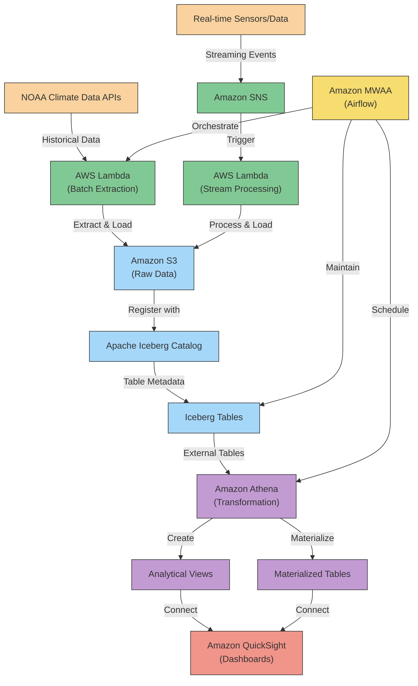
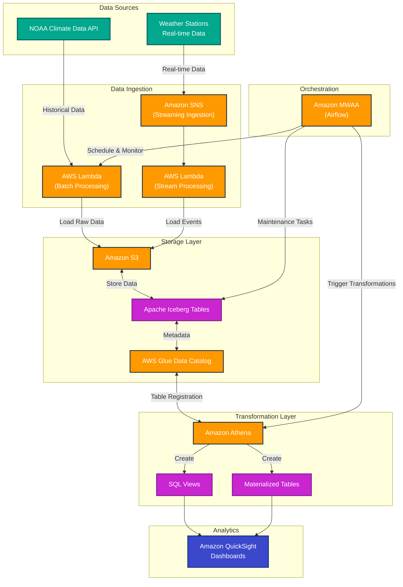

# Real-time Climate Data Analytics Platform with ELT

This project implements a modern data lake architecture using Apache Iceberg on Amazon Web Services (AWS). The focus is on Extract-Load-Transform (ELT) rather than ETL, leveraging Amazon Athena's powerful transformation capabilities while maintaining data lake flexibility with Iceberg.

We'll use public climate data from NOAA to build a comprehensive data platform that showcases AWS services integration with Iceberg table format.

### Solution Architecture Diagram

Here's the architecture diagram for our ELT data lake solution:



The architecture diagram illustrates our complete ELT data lake solution with the following components:

1. Data Sources: NOAA Climate Data APIs for historical data and simulated real-time data sources
2. Extract Layer: AWS Lambda for batch extraction and Amazon SNS with Lambda for streaming data
3. Load/Storage Layer: Raw data stored in Amazon S3 and registered with Apache Iceberg
4. Transform Layer: Amazon Athena accesses Iceberg tables to create analytical views and materialized tables
5. Orchestration: Amazon MWAA (Managed Workflows for Apache Airflow) coordinates all data processing activities
6. Analytics & Visualization: Amazon QuickSight connects to Athena for dashboarding and data exploration

## Architecture Overview

The project architecture follows modern data lake patterns with an ELT approach:

1. Data Extraction: Amazon SNS for real-time data, Lambda for batch extraction
2. Loading: Direct loading into S3 data lake with Apache Iceberg format
3. Transformation: Amazon Athena for in-place transformations
4. Query Engine: Amazon Athena for analytics
5. Orchestration: Amazon MWAA (managed Airflow)

## Step 1: Set Up AWS Environment

First, we need to set up our Amazon Web Services environment with all necessary services and permissions.

### Create AWS Resources

```bash
# Install AWS CLI if not already installed
# https://docs.aws.amazon.com/cli/latest/userguide/getting-started-install.html

# Configure AWS CLI with your credentials
aws configure

# Create an S3 bucket for raw data
aws s3 mb s3://climate-lake-raw-data --region ap-southeast-2

# Create an S3 bucket for Iceberg tables
aws s3 mb s3://climate-lake-iceberg-tables --region ap-southeast-2

# Create an AWS Glue Database for Iceberg catalog
aws glue create-database --database-input '{"Name":"climate_catalog"}' --region ap-southeast-2
```

### Create IAM Roles and Policies

```bash
# Create IAM role for data operations
aws iam create-role --role-name data-lake-role \
    --assume-role-policy-document '{
        "Version": "2012-10-17",
        "Statement": [
            {
                "Effect": "Allow",
                "Principal": {
                    "Service": [
                        "lambda.amazonaws.com",
                        "glue.amazonaws.com",
                        "athena.amazonaws.com"
                    ]
                },
                "Action": "sts:AssumeRole"
            }
        ]
    }'

# Attach policies for S3 access
aws iam attach-role-policy --role-name data-lake-role \
    --policy-arn arn:aws:iam::aws:policy/AmazonS3FullAccess

# Attach policies for Glue access
aws iam attach-role-policy --role-name data-lake-role \
    --policy-arn arn:aws:iam::aws:policy/service-role/AWSGlueServiceRole

# Attach policies for Athena access
aws iam attach-role-policy --role-name data-lake-role \
    --policy-arn arn:aws:iam::aws:policy/AmazonAthenaFullAccess
```

### Initialize Local Development Environment

```bash
# Create a virtual environment for Python development
python -m venv iceberg-env
source iceberg-env/bin/activate  # On Windows: iceberg-env\Scripts\activate

# Install required packages
pip install boto3 \
            pyiceberg[s3,glue] \
            pandas \
            pyarrow \
            apache-airflow \
            requests
```

## Step 2: Data Lake Storage Setup with Iceberg

In this step, we'll set up our S3 buckets and configure Apache Iceberg to work with AWS Glue Data Catalog as the metadata store.

## Solution Architecture Diagram

Here's the solution architecture diagram showing the data flow and component interaction:



### Create S3 Buckets

```bash
# Create S3 buckets for the data lake zones
aws s3 mb s3://climate-lake-raw-data --region ap-southeast-2
aws s3 mb s3://climate-lake-iceberg-tables --region ap-southeast-2
```

### Configure Apache Iceberg

We'll set up a Python script to configure the Iceberg catalog and create our initial table schemas.

```python
# iceberg_setup.py - Part 1

from pyiceberg.catalog import load_catalog
import os
import boto3

# Set environment variables, or use .env file to specify values of environment variables.
os.environ["AWS_ACCESS_KEY_ID"] = "your-aws-access-key"
os.environ["AWS_SECRET_ACCESS_KEY"] = "your-aws-secret-key"
os.environ["AWS_REGION"] = "ap-southeast-2"

# Create a catalog configuration
catalog_config = {
    "type": "glue",
    "warehouse": "s3://climate-lake-iceberg-tables",
    "s3.region": "ap-southeast-2"
}

# Load the catalog
iceberg_catalog = load_catalog("climate_catalog", **catalog_config)

# Create a namespace (equivalent to a database in Glue)
iceberg_catalog.create_namespace("climate_data")
```

```python
# iceberg_setup.py - Part 2 (Schema definitions)

# Schema for weather stations metadata
stations_schema = {
    "type": "struct",
    "fields": [
        {"id": 1, "name": "station_id", "type": "string", "required": True},
        {"id": 2, "name": "name", "type": "string"},
        {"id": 3, "name": "latitude", "type": "double"},
        {"id": 4, "name": "longitude", "type": "double"},
        {"id": 5, "name": "elevation", "type": "double"},
        {"id": 6, "name": "country", "type": "string"},
        {"id": 7, "name": "state", "type": "string"},
        {"id": 8, "name": "first_year", "type": "int"},
        {"id": 9, "name": "last_year", "type": "int"}
    ]
}

# Schema for daily weather observations
observations_schema = {
    "type": "struct",
    "fields": [
        {"id": 1, "name": "station_id", "type": "string", "required": True},
        {"id": 2, "name": "date", "type": "date", "required": True},
        {"id": 3, "name": "element", "type": "string", "required": True},
        {"id": 4, "name": "value", "type": "double"},
        {"id": 5, "name": "measurement_flag", "type": "string"},
        {"id": 6, "name": "quality_flag", "type": "string"},
        {"id": 7, "name": "source_flag", "type": "string"},
        {"id": 8, "name": "observation_time", "type": "timestamp"}
    ]
}
```

```python
# iceberg_setup.py - Part 3 (Create tables)

# Create the tables
stations_table_properties = {
    "format-version": "2",
    "write.parquet.compression-codec": "zstd",
    "write.metadata.compression-codec": "gzip"
}

iceberg_catalog.create_table(
    identifier=("climate_data", "stations"),
    schema=stations_schema,
    properties=stations_table_properties
)

# Partitioning for the observations table by year and month for efficient queries
observations_partitioning = [
    {"name": "year", "transform": "year(date)"},
    {"name": "month", "transform": "month(date)"}
]

observations_table_properties = {
    "format-version": "2",
    "write.parquet.compression-codec": "zstd",
    "write.metadata.compression-codec": "gzip"
}

iceberg_catalog.create_table(
    identifier=("climate_data", "observations"),
    schema=observations_schema,
    partition_spec=observations_partitioning,
    properties=observations_table_properties
)

print("Iceberg tables created successfully!")
```

Execute the script to set up the Iceberg catalog and tables:

```bash
python iceberg_setup.py
```

This will create our Iceberg catalog and tables with appropriate schemas. The tables are designed with climate data in mind, with stations containing metadata about weather stations and observations containing the actual weather measurements.

## Step 3: Data Extraction and Loading Pipelines

In this step, we'll create two pipelines: one for batch extraction and loading of historical climate data, and another for simulating real-time data ingestion through Amazon SNS.

### Batch Extraction and Loading

First, let's create a Python script to download and load historical NOAA GHCN (Global Historical Climatology Network) data into our data lake.

```python
# batch_loader.py - Part 1

import os
import requests
import pandas as pd
import pyarrow as pa
import pyarrow.parquet as pq
from pyiceberg.catalog import load_catalog
import boto3
import tempfile
import datetime
import time

# Set environment variables for authentication
os.environ["AWS_ACCESS_KEY_ID"] = "your-aws-access-key"
os.environ["AWS_SECRET_ACCESS_KEY"] = "your-aws-secret-key"
os.environ["AWS_REGION"] = "ap-southeast-2"

# Constants
GHCN_STATIONS_URL = "https://www1.ncdc.noaa.gov/pub/data/ghcn/daily/ghcnd-stations.txt"
GHCN_DATA_URL = "https://www1.ncdc.noaa.gov/pub/data/ghcn/daily/by_year/"
RAW_BUCKET = "climate-lake-raw-data"

# Initialize S3 client
s3_client = boto3.client('s3')

# Initialize Iceberg catalog
catalog_config = {
    "type": "glue",
    "warehouse": f"s3://{RAW_BUCKET}",
    "s3.region": "ap-southeast-2"
}

iceberg_catalog = load_catalog("climate_catalog", **catalog_config)
```

```python
# batch_loader.py - Part 2A (Helper functions)

def download_and_upload_to_s3(url, bucket_name, object_key):
    """Download data from URL and upload to S3 bucket"""
    print(f"Downloading {url}...")
    response = requests.get(url)
    response.raise_for_status()
    
    s3_client.put_object(
        Bucket=bucket_name,
        Key=object_key,
        Body=response.content
    )
    print(f"Uploaded to s3://{bucket_name}/{object_key}")
    return response.content
```

```python
# batch_loader.py - Part 2B (Process stations data)

def process_stations_data():
    """Process GHCN stations data and load to Iceberg"""
    print("Processing stations data...")
    
    # Download stations data
    content = download_and_upload_to_s3(
        GHCN_STATIONS_URL, 
        RAW_BUCKET, 
        "ghcn/stations/ghcnd-stations.txt"
    )
    
    # Parse fixed-width format
    # Format spec: https://www1.ncdc.noaa.gov/pub/data/ghcn/daily/readme.txt
    stations_data = []
    for line in content.decode('utf-8').splitlines():
        if len(line) < 85:  # Skip malformed lines
            continue
        
        stations_data.append({
            'station_id': line[0:11].strip(),
            'latitude': float(line[12:20].strip() or 0),
            'longitude': float(line[21:30].strip() or 0),
            'elevation': float(line[31:37].strip() or 0),
            'name': line[41:71].strip(),
            'country': line[38:40].strip(),
            'state': line[38:40].strip() if line[38:40].strip() == 'US' else '',
            'first_year': int(line[74:79].strip() or 0),
            'last_year': int(line[79:85].strip() or 0)
        })
```

```python
# batch_loader.py - Part 2C (Complete stations processing)

    # Create DataFrame
    df = pd.DataFrame(stations_data)
    
    # Get Iceberg table
    stations_table = iceberg_catalog.load_table("climate_data.stations")
    
    # Write to temporary Parquet file
    with tempfile.NamedTemporaryFile(suffix='.parquet') as tmp:
        table = pa.Table.from_pandas(df)
        pq.write_table(table, tmp.name)
        
        # Upload to S3
        stations_blob_name = f"iceberg/stations/data/stations_{int(time.time())}.parquet"
        s3_client.upload_file(
            tmp.name,
            RAW_BUCKET,
            stations_blob_name
        )
    
    # Register data with Iceberg
    stations_table.append(f"s3://{RAW_BUCKET}/{stations_blob_name}")
    
    print(f"Loaded {len(df)} stations to Iceberg table")
    return df
```

```python
# batch_loader.py - Part 3A (Process observations)

def process_observations_data(year, stations_df=None):
    """Process GHCN observations data for a specific year and load to Iceberg"""
    print(f"Processing observations data for year {year}...")
    
    # Download year data
    url = f"{GHCN_DATA_URL}{year}.csv.gz"
    blob_name = f"ghcn/observations/by_year/{year}.csv.gz"
    
    try:
        content = download_and_upload_to_s3(url, RAW_BUCKET, blob_name)
        print(f"Downloaded data for year {year}")
    except requests.exceptions.HTTPError as e:
        print(f"Error downloading data for year {year}: {e}")
        return None
    
    # If we got stations data as parameter, filter only for certain stations
    # This is helpful to limit the data volume for demonstration purposes
    filter_stations = stations_df is not None
    
    # Process the CSV data
    # Format: station_id,date,element,value,m-flag,q-flag,s-flag,obs-time
    # Example: USC00045721,20150101,PRCP,0,,,P,
    
    # Create a temporary directory for processing chunks
    with tempfile.TemporaryDirectory() as tmpdir:
        # Stream and process the gzipped CSV in chunks
        # For demonstration, we'll process just a subset of records
        max_records = 100000  # Limit for demonstration
        processed_records = 0
        chunk_size = 10000
        chunk_counter = 0
```

```python
# batch_loader.py - Part 3B (Process observations chunks)

        # Get Iceberg table
        observations_table = iceberg_catalog.load_table("climate_data.observations")
        
        # Process in chunks and write each chunk as a separate file
        parquet_files = []
        
        # In a real implementation, use a proper CSV parser with streaming
        # Here we'll simulate it with a simplified approach for demonstration
        import gzip
        import io
        import csv
        
        with gzip.open(io.BytesIO(content), 'rt') as f:
            reader = csv.reader(f)
            chunk_data = []
            
            for row in reader:
                if len(row) < 8:  # Skip malformed rows
                    continue
                    
                # Filter by stations if needed
                if filter_stations and row[0] not in stations_df['station_id'].values:
                    continue
                    
                # Parse and validate date format (YYYYMMDD)
                try:
                    date_str = row[1]
                    date_obj = datetime.date(int(date_str[0:4]), int(date_str[4:6]), int(date_str[6:8]))
                except (ValueError, IndexError):
                    continue
                
                # Add record to chunk
                chunk_data.append({
                    'station_id': row[0],
                    'date': date_obj,
                    'element': row[2],
                    'value': float(row[3]) / 10.0 if row[2] in ['TMIN', 'TMAX', 'TAVG', 'PRCP'] else float(row[3]),
                    'measurement_flag': row[4] if row[4] else None,
                    'quality_flag': row[5] if row[5] else None,
                    'source_flag': row[6] if row[6] else None,
                    'observation_time': row[7] if row[7] else None
                })
```

```python
# batch_loader.py - Part 3C (Complete observations processing)

                processed_records += 1
                
                # When chunk is full or we've reached the max records, write to parquet
                if len(chunk_data) >= chunk_size or processed_records >= max_records:
                    # Create dataframe from chunk
                    chunk_df = pd.DataFrame(chunk_data)
                    
                    # Write to parquet
                    parquet_file = os.path.join(tmpdir, f"chunk_{chunk_counter}.parquet")
                    table = pa.Table.from_pandas(chunk_df)
                    pq.write_table(table, parquet_file)
                    
                    # Upload to S3
                    parquet_object_key = f"iceberg/observations/data/year={year}/chunk_{chunk_counter}_{int(time.time())}.parquet"
                    s3_client.upload_file(
                        parquet_file,
                        RAW_BUCKET,
                        parquet_object_key
                    )
                    parquet_files.append(f"s3://{RAW_BUCKET}/{parquet_object_key}")
                    
                    # Reset for next chunk
                    chunk_data = []
                    chunk_counter += 1
                    
                # If we've reached max records, stop
                if processed_records >= max_records:
                    break
        
        # Register all parquet files with Iceberg
        if parquet_files:
            observations_table.append(parquet_files)
            print(f"Loaded {processed_records} observations to Iceberg table for year {year}")
        else:
            print(f"No observations were processed for year {year}")
        
        return processed_records
```

```python
# batch_loader.py - Part 4 (Main function)

def main():
    """Run the batch loader process"""
    # Load stations data
    stations_df = process_stations_data()
    
    # Process observations for recent years (for demonstration)
    # In production, you might load more years or have a scheduled process
    # that loads new data incrementally
    for year in range(2020, 2023):
        process_observations_data(year, stations_df)

if __name__ == "__main__":
    main()
```

We can now run this script to extract data from NOAA, load it into our raw S3 buckets, and register it with our Iceberg tables:

```bash
python batch_loader.py
```

### AWS Lambda for Batch Processing

To make this more production-ready, we can wrap this in an AWS Lambda function that can be triggered on a schedule. Let's create a basic Lambda function that runs our batch loader:

```python
# lambda_function.py (AWS Lambda)

import json
import datetime
from batch_loader import process_stations_data, process_observations_data

def lambda_handler(event, context):
    """AWS Lambda handler for climate data loading process.
    
    Args:
        event: Lambda event input
        context: Lambda context
    Returns:
        Lambda response with processing information
    """
    # Check if specific year was provided
    year = None
    if event and 'year' in event:
        year = int(event['year'])
    else:
        # Default to previous year if not specified
        year = datetime.datetime.now().year - 1
    
    # Process stations data first
    stations_df = process_stations_data()
    
    # Process observations for the specified year
    processed_records = process_observations_data(year, stations_df)
    
    return {
        'statusCode': 200,
        'body': json.dumps(f"Processed {processed_records} climate data records for year {year}.")
    }
```

For the Lambda function, we need a `requirements.txt` file:

```
# requirements.txt

boto3==1.28.38
pyiceberg[s3,glue]==0.16.1
pandas==2.0.1
pyarrow==12.0.0
requests==2.31.0
```

We can deploy this Lambda function using the AWS CLI:

```bash
# Create a deployment package
pip install -r requirements.txt -t ./package
cd package
zip -r ../lambda_deployment.zip .
cd ..
zip -g lambda_deployment.zip lambda_function.py batch_loader.py

# Deploy the Lambda function
aws lambda create-function \
  --function-name climate-data-loader \
  --runtime python3.9 \
  --role arn:aws:iam::<account-id>:role/data-lake-role \
  --handler lambda_function.lambda_handler \
  --timeout 900 \
  --memory-size 2048 \
  --zip-file fileb://lambda_deployment.zip
```

### Amazon EventBridge for Automated Execution

Let's set up an EventBridge rule to trigger our Lambda function automatically. This will pull data daily from the NOAA API:

```bash
# Create an EventBridge rule
aws events put-rule \
  --name climate-data-daily-job \
  --schedule-expression "cron(0 2 * * ? *)" \
  --state ENABLED

# Add permission for EventBridge to invoke Lambda
aws lambda add-permission \
  --function-name climate-data-loader \
  --statement-id climate-data-scheduled-event \
  --action 'lambda:InvokeFunction' \
  --principal events.amazonaws.com \
  --source-arn arn:aws:events:<region>:<account-id>:rule/climate-data-daily-job

# Set the Lambda function as the target for the rule
aws events put-targets \
  --rule climate-data-daily-job \
  --targets '[{"Id": "1", "Arn": "arn:aws:lambda:<region>:<account-id>:function:climate-data-loader"}]'
```

This scheduler will run our data load function every day at 2:00 AM UTC.

### Streaming Pipeline with Amazon SNS

Let's create a streaming pipeline to simulate real-time climate data ingestion. First, we'll set up an Amazon SNS topic:

```bash
# Create an SNS topic for climate data
aws sns create-topic --name climate-data-stream
```

Now, let's create a Lambda function that will be triggered when a message is published to this topic:

```python
# stream_processor.py - Part 1 (Imports and Setup)

import json
import base64
import pandas as pd
import pyarrow as pa
import pyarrow.parquet as pq
import tempfile
import time
import os
from datetime import datetime
import boto3
from pyiceberg.catalog import load_catalog

# Set environment variables for authentication
os.environ["AWS_REGION"] = "ap-southeast-2"

# Constants
RAW_BUCKET = "climate-lake-raw-data"

# Initialize S3 client
s3_client = boto3.client('s3')

# Initialize Iceberg catalog
catalog_config = {
    "type": "glue",
    "warehouse": f"s3://{RAW_BUCKET}",
    "s3.region": "ap-southeast-2"
}

iceberg_catalog = load_catalog("climate_catalog", **catalog_config)
```

```python
# stream_processor.py - Part 2 (Lambda Function Implementation)

def lambda_handler(event, context):
    """When a message is published to SNS, this function is triggered.
    The function processes the climate data and saves it to Iceberg.
    
    Args:
        event: Lambda event containing the SNS message
        context: Lambda context
    """
    # Get the SNS message
    try:
        # For SNS, the message is in Records[0].Sns.Message
        if 'Records' in event and event['Records'][0]['EventSource'] == 'aws:sns':
            message_text = event['Records'][0]['Sns']['Message']
        else:
            # For direct Lambda invocation
            message_text = json.dumps(event)
        
        print(f"Received message: {message_text}")
        
        # Parse the message as JSON
        message_data = json.loads(message_text)
        
        # Create a DataFrame from the message
        df = pd.DataFrame([message_data])
        
        # Validate required fields
        required_fields = ['station_id', 'date', 'element', 'value']
        for field in required_fields:
            if field not in df.columns:
                raise ValueError(f"Required field '{field}' missing from message")
        
        # Convert date string to date object if needed
        if isinstance(df['date'].iloc[0], str):
            df['date'] = pd.to_datetime(df['date']).dt.date
```

```python
# stream_processor.py - Part 3 (Writing to Iceberg)
        
        # Get the Iceberg table
        observations_table = iceberg_catalog.load_table("climate_data.observations")
        
        # Write to temporary Parquet file
        with tempfile.NamedTemporaryFile(suffix='.parquet') as tmp:
            # Convert DataFrame to PyArrow Table and write to Parquet
            table = pa.Table.from_pandas(df)
            pq.write_table(table, tmp.name)
            
            # Generate S3 key with correct partitioning
            # Extract year and month for partitioning
            if isinstance(df['date'].iloc[0], str):
                date_obj = datetime.strptime(df['date'].iloc[0], '%Y-%m-%d')
            else:
                date_obj = df['date'].iloc[0]
                
            year = date_obj.year
            month = date_obj.month
            
            # Create S3 key with partitioning
            parquet_key = f"iceberg/observations/data/year={year}/month={month}/stream_{int(time.time())}.parquet"
            
            # Upload to S3
            s3_client.upload_file(
                tmp.name, 
                RAW_BUCKET, 
                parquet_key
            )
            
            # Register with Iceberg
            observations_table.append(f"s3://{RAW_BUCKET}/{parquet_key}")
            
            print(f"Successfully processed streaming record and wrote to Iceberg table")
            return {
                'statusCode': 200,
                'body': json.dumps('Success')
            }
    
    except Exception as e:
        print(f"Error processing message: {str(e)}")
        return {
            'statusCode': 500,
            'body': json.dumps(f"Error: {str(e)}")
        }
```

Now we can deploy this Lambda function with the following command:

```bash
# Create a deployment package
pip install -r requirements.txt -t ./stream_package
cd stream_package
zip -r ../stream_lambda.zip .
cd ..
zip -g stream_lambda.zip stream_processor.py

# Deploy the Lambda function
aws lambda create-function \
  --function-name climate-data-stream-processor \
  --runtime python3.9 \
  --role arn:aws:iam::<account-id>:role/data-lake-role \
  --handler stream_processor.lambda_handler \
  --timeout 60 \
  --memory-size 512 \
  --zip-file fileb://stream_lambda.zip

# Configure SNS to trigger the Lambda function
aws lambda add-permission \
  --function-name climate-data-stream-processor \
  --statement-id sns-climate-data \
  --action 'lambda:InvokeFunction' \
  --principal sns.amazonaws.com \
  --source-arn arn:aws:sns:<region>:<account-id>:climate-data-stream

# Subscribe the Lambda function to the SNS topic
aws sns subscribe \
  --topic-arn arn:aws:sns:<region>:<account-id>:climate-data-stream \
  --protocol lambda \
  --notification-endpoint arn:aws:lambda:<region>:<account-id>:function:climate-data-stream-processor
```

To test our streaming pipeline, we can publish a test message to the SNS topic:

```bash
# Create a test message file
cat > test_message.json << EOL
{
  "station_id": "USW00094728",
  "date": "2023-07-01",
  "element": "TMAX",
  "value": 32.5,
  "measurement_flag": "",
  "quality_flag": "",
  "source_flag": "S",
  "observation_time": "15:00"
}
EOL

# Publish the message to SNS
aws sns publish \
  --topic-arn arn:aws:sns:<region>:<account-id>:climate-data-stream \
  --message file://test_message.json
```

## Step 4: Transformation in Amazon Athena

Now that we have our data loading pipelines set up, let's implement the transformation layer in Amazon Athena. This is where the ELT approach differs from ETL - we'll transform the data after it's loaded.

### Connect Amazon Athena to Iceberg Tables

Since we're using AWS Glue Data Catalog, Iceberg tables are automatically available in Athena. Let's create some transformations and views on top of these tables to make the data more usable for analytics.

First, let's create a workgroup for our Athena queries:

```bash
# Create an Athena workgroup
aws athena create-work-group \
  --name climate-data-workgroup \
  --configuration 'ResultConfiguration={OutputLocation=s3://climate-lake-raw-data/athena-results/}'
```

### Create Transformation Views in Athena

Now, let's create SQL views to transform our data for analysis:

```sql
-- Create a view that pivots temperature and precipitation data for easier analysis
CREATE OR REPLACE VIEW daily_weather_summary AS
WITH temperature_data AS (
  SELECT
    station_id,
    date,
    MAX(CASE WHEN element = 'TMAX' THEN value END) AS max_temp_celsius,
    MAX(CASE WHEN element = 'TMIN' THEN value END) AS min_temp_celsius,
    MAX(CASE WHEN element = 'TAVG' THEN value END) AS avg_temp_celsius,
    MAX(CASE WHEN element = 'PRCP' THEN value END) AS precipitation_mm,
    MAX(CASE WHEN element = 'SNOW' THEN value END) AS snowfall_mm,
    MAX(CASE WHEN element = 'SNWD' THEN value END) AS snow_depth_mm
  FROM
    climate_catalog.climate_data.observations
  WHERE
    element IN ('TMAX', 'TMIN', 'TAVG', 'PRCP', 'SNOW', 'SNWD')
  GROUP BY
    station_id, date
)
SELECT
  t.*,
  s.name AS station_name,
  s.latitude,
  s.longitude,
  s.elevation,
  s.country,
  s.state
FROM
  temperature_data t
JOIN
  climate_catalog.climate_data.stations s
ON
  t.station_id = s.station_id;
```

Now, let's create a more specialized view for monthly climate summaries:

```sql
-- Create a monthly climate summary view
CREATE OR REPLACE VIEW monthly_climate_summary AS
SELECT
  station_id,
  station_name,
  country,
  state,
  latitude,
  longitude,
  EXTRACT(YEAR FROM date) AS year,
  EXTRACT(MONTH FROM date) AS month,
  AVG(max_temp_celsius) AS avg_max_temp,
  AVG(min_temp_celsius) AS avg_min_temp,
  AVG(avg_temp_celsius) AS avg_temp,
  MAX(max_temp_celsius) AS highest_max_temp,
  MIN(min_temp_celsius) AS lowest_min_temp,
  SUM(precipitation_mm) AS total_precipitation,
  COUNT(date) AS days_in_month
FROM
  daily_weather_summary
WHERE
  max_temp_celsius IS NOT NULL OR
  min_temp_celsius IS NOT NULL OR
  precipitation_mm IS NOT NULL
GROUP BY
  station_id, station_name, country, state, latitude, longitude, year, month
ORDER BY
  station_id, year, month;
```

Let's also create a materialized table for faster query performance on the most commonly accessed data using the CTAS (Create Table As Select) feature in Athena:

```sql
-- Create a materialized table for commonly accessed data
CREATE TABLE annual_climate_summary
WITH (
  format = 'PARQUET',
  partitioned_by = ARRAY['year'],
  external_location = 's3://climate-lake-iceberg-tables/materialized/annual_climate/'
) AS
SELECT
  station_id,
  station_name,
  country,
  state,
  latitude,
  longitude,
  year,
  AVG(avg_max_temp) AS yearly_avg_max_temp,
  AVG(avg_min_temp) AS yearly_avg_min_temp,
  AVG(avg_temp) AS yearly_avg_temp,
  MAX(highest_max_temp) AS yearly_highest_max_temp,
  MIN(lowest_min_temp) AS yearly_lowest_min_temp,
  SUM(total_precipitation) AS yearly_total_precipitation,
  SUM(days_in_month) AS days_with_data
FROM
  monthly_climate_summary
GROUP BY
  station_id, station_name, country, state, latitude, longitude, year
ORDER BY
  country, state, station_id, year;
```

### Create Scheduled Query in Athena

We can use EventBridge and Lambda to schedule the refresh of our materialized table. First, let's create a Lambda function to run the Athena query:

```python
# athena_refresh.py

import boto3
import time
import os

def lambda_handler(event, context):
    # Initialize Athena client
    athena = boto3.client('athena')
    
    # Define our query
    query = """
    INSERT INTO annual_climate_summary
    SELECT
      station_id,
      station_name,
      country,
      state,
      latitude,
      longitude,
      year,
      AVG(avg_max_temp) AS yearly_avg_max_temp,
      AVG(avg_min_temp) AS yearly_avg_min_temp,
      AVG(avg_temp) AS yearly_avg_temp,
      MAX(highest_max_temp) AS yearly_highest_max_temp,
      MIN(lowest_min_temp) AS yearly_lowest_min_temp,
      SUM(total_precipitation) AS yearly_total_precipitation,
      SUM(days_in_month) AS days_with_data
    FROM
      monthly_climate_summary
    WHERE
      year = EXTRACT(YEAR FROM CURRENT_DATE) - 1
    GROUP BY
      station_id, station_name, country, state, latitude, longitude, year
    """
    
    # Execute the query
    response = athena.start_query_execution(
        QueryString=query,
        QueryExecutionContext={
            'Database': 'climate_catalog'
        },
        ResultConfiguration={
            'OutputLocation': 's3://climate-lake-raw-data/athena-results/'
        },
        WorkGroup='climate-data-workgroup'
    )
    
    # Get query execution ID
    query_execution_id = response['QueryExecutionId']
    print(f"Started query: {query_execution_id}")
    
    # Wait for query to complete
    state = 'RUNNING'
    while state == 'RUNNING' or state == 'QUEUED':
        response = athena.get_query_execution(QueryExecutionId=query_execution_id)
        state = response['QueryExecution']['Status']['State']
        if state == 'RUNNING' or state == 'QUEUED':
            time.sleep(1)
    
    # Check if query was successful
    if state == 'SUCCEEDED':
        print(f"Query {query_execution_id} completed successfully.")
        return {
            'statusCode': 200,
            'body': f"Query {query_execution_id} completed successfully."
        }
    else:
        error_message = response['QueryExecution']['Status']['StateChangeReason']
        print(f"Query {query_execution_id} failed: {error_message}")
        return {
            'statusCode': 500,
            'body': f"Query failed: {error_message}"
        }
```

Now let's schedule this Lambda function to run daily:

```bash
# Create the Lambda function for Athena query
aws lambda create-function \
  --function-name refresh-climate-materialized-view \
  --runtime python3.9 \
  --role arn:aws:iam::<account-id>:role/data-lake-role \
  --handler athena_refresh.lambda_handler \
  --timeout 300 \
  --memory-size 128 \
  --zip-file fileb://athena_refresh.zip

# Create an EventBridge rule to run daily at 3:00 AM UTC
aws events put-rule \
  --name daily-climate-data-refresh \
  --schedule-expression "cron(0 3 * * ? *)" \
  --state ENABLED

# Set the Lambda function as the target for the rule
aws events put-targets \
  --rule daily-climate-data-refresh \
  --targets '[{"Id": "1", "Arn": "arn:aws:lambda:<region>:<account-id>:function:refresh-climate-materialized-view"}]'

# Add permission for EventBridge to invoke Lambda
aws lambda add-permission \
  --function-name refresh-climate-materialized-view \
  --statement-id climate-data-scheduled-refresh \
  --action 'lambda:InvokeFunction' \
  --principal events.amazonaws.com \
  --source-arn arn:aws:events:<region>:<account-id>:rule/daily-climate-data-refresh
```

With these transformations, we've created a robust data pipeline that follows the ELT pattern:

1. Extract: Data is pulled from NOAA sources via batch and streaming methods
2. Load: Raw data is loaded directly into S3 and registered with Apache Iceberg
3. Transform: Data is transformed in Amazon Athena using SQL views and materialized tables

## Step 5: Orchestration with Amazon MWAA

To orchestrate our entire data pipeline, we'll use Amazon Managed Workflows for Apache Airflow (MWAA). This will help us coordinate the batch data extraction, loading, and transformation processes.

### Create Amazon MWAA Environment

First, we need to set up an Amazon S3 bucket for MWAA and upload our DAG files:

```bash
# Create an S3 bucket for MWAA
aws s3 mb s3://climate-data-mwaa --region ap-southeast-2

# Create directories for MWAA
mkdir -p mwaa/dags mwaa/plugins mwaa/requirements

# Create a requirements.txt file for MWAA
cat > mwaa/requirements/requirements.txt << EOL
apache-airflow-providers-amazon>=2.0.0
pyiceberg[s3,glue]<=0.9.1
EOL

# Upload files to S3
aws s3 cp mwaa/requirements/requirements.txt s3://climate-data-mwaa/requirements.txt
```

Now, let's create an MWAA environment:

```bash
# Create MWAA environment
aws mwaa create-environment \
  --name climate-data-orchestrator \
  --source-bucket-arn arn:aws:s3:::climate-data-mwaa \
  --dag-s3-path dags \
  --network-configuration '{"SubnetIds": ["subnet-xxxx", "subnet-yyyy"],"SecurityGroupIds": ["sg-zzzz"]}' \
  --execution-role-arn arn:aws:iam::<account-id>:role/mwaa-execution-role \
  --airflow-version 2.4.3 \
  --environment-class mw1.small \
  --max-workers 2 \
  --requirements-s3-path requirements.txt
```

Now, let's create our DAG file to orchestrate the data pipeline:

```python
# climate_data_dag.py

from airflow import DAG
from airflow.operators.python import PythonOperator
from airflow.providers.amazon.aws.operators.lambda_function import AwsLambdaInvokeOperator
from airflow.providers.amazon.aws.operators.athena import AthenaOperator
from datetime import datetime, timedelta
import json
import boto3

# Define default arguments
default_args = {
    'owner': 'airflow',
    'depends_on_past': False,
    'email_on_failure': False,
    'email_on_retry': False,
    'retries': 1,
    'retry_delay': timedelta(minutes=5),
}

# Define DAG
with DAG(
    'climate_data_pipeline',
    default_args=default_args,
    description='Climate Data Lake ELT Pipeline',
    schedule_interval='0 1 * * *',  # Run daily at 1:00 AM UTC
    start_date=datetime(2023, 1, 1),
    catchup=False,
    tags=['climate', 'data-lake', 'iceberg'],
) as dag:

    # Task 1: Load Stations Data
    load_stations = AwsLambdaInvokeOperator(
        task_id='load_stations_data',
        function_name='climate-data-loader',
        payload=json.dumps({'load_stations_only': True}),
    )

    # Task 2: Load Observations Data (for yesterday)
    yesterday = '{{ macros.ds_add(ds, -1) }}'
    load_observations = AwsLambdaInvokeOperator(
        task_id='load_observations_data',
        function_name='climate-data-loader',
        payload=json.dumps({'year': '{{ execution_date.year }}', 'month': '{{ execution_date.month }}', 'day': '{{ execution_date.day }}'}),
    )
```

```python
    # Task 3: Run Data Quality Check on Iceberg Tables
    check_tables_query = """
    SELECT 
        'stations' as table_name, COUNT(*) as row_count 
    FROM 
        climate_catalog.climate_data.stations
    UNION ALL
    SELECT 
        'observations' as table_name, COUNT(*) as row_count 
    FROM 
        climate_catalog.climate_data.observations
    WHERE 
        date = DATE '{{ execution_date.strftime("%Y-%m-%d") }}'
    """
    
    run_dq_check = AthenaOperator(
        task_id='run_data_quality_check',
        query=check_tables_query,
        database='climate_catalog',
        output_location='s3://climate-lake-raw-data/athena-results/',
        aws_conn_id='aws_default',
    )
```

```python
    # Task 4: Refresh Materialized View
    refresh_view_query = """
    INSERT INTO climate_catalog.climate_data.annual_climate_summary
    SELECT
      station_id,
      station_name,
      country,
      state,
      latitude,
      longitude,
      year,
      AVG(avg_max_temp) AS yearly_avg_max_temp,
      AVG(avg_min_temp) AS yearly_avg_min_temp,
      AVG(avg_temp) AS yearly_avg_temp,
      MAX(highest_max_temp) AS yearly_highest_max_temp,
      MIN(lowest_min_temp) AS yearly_lowest_min_temp,
      SUM(total_precipitation) AS yearly_total_precipitation,
      SUM(days_in_month) AS days_with_data
    FROM
      climate_catalog.climate_data.monthly_climate_summary
    WHERE
      year = EXTRACT(YEAR FROM CURRENT_DATE) - 1
    GROUP BY
      station_id, station_name, country, state, latitude, longitude, year
    """
    
    refresh_materialized_view = AthenaOperator(
        task_id='refresh_materialized_view',
        query=refresh_view_query,
        database='climate_catalog',
        output_location='s3://climate-lake-raw-data/athena-results/',
        aws_conn_id='aws_default',
    )
```

```python
    # Task 5: Perform Iceberg Maintenance (compaction)
    def run_iceberg_maintenance():
        from pyiceberg.catalog import load_catalog
        import os
        
        catalog_config = {
            "type": "glue",
            "warehouse": "s3://climate-lake-iceberg-tables",
            "s3.region": "ap-southeast-2"
        }
        
        iceberg_catalog = load_catalog("climate_catalog", **catalog_config)
        
        stations_table = iceberg_catalog.load_table("climate_data.stations")
        observations_table = iceberg_catalog.load_table("climate_data.observations")
        
        # Compact small files
        stations_table.rewrite_data_files()
        observations_table.rewrite_data_files()
        
        return "Maintenance completed successfully"
    
    run_maintenance = PythonOperator(
        task_id='run_iceberg_maintenance',
        python_callable=run_iceberg_maintenance,
    )
    
    # Define task dependencies
    load_stations >> load_observations >> run_dq_check >> refresh_materialized_view >> run_maintenance
```

Upload the DAG to Amazon MWAA:

```bash
# Save the DAG file
cat > mwaa/dags/climate_data_dag.py << EOL
# Paste DAG code here
EOL

# Upload the DAG to S3
aws s3 cp mwaa/dags/climate_data_dag.py s3://climate-data-mwaa/dags/
```

This Airflow DAG orchestrates our entire pipeline:

1. Load stations metadata from NOAA
2. Load observations data for the current execution date
3. Run data quality checks on the Iceberg tables
4. Refresh the materialized views for analytics
5. Perform Iceberg table maintenance for optimal performance

## Step 6: Analytics and Visualization

Now that we have our data pipeline set up, we can create visualizations and analytics dashboards using Amazon QuickSight connected to our Athena views.

### Connect Amazon QuickSight to Athena

Follow these steps to create a dashboard in Amazon QuickSight:

1. Go to the Amazon QuickSight console and sign in
2. Select "New analysis"
3. Select "New dataset"
4. Choose "Athena" as the data source
5. Configure the Athena connection (if not already set up)
6. Select the `climate_catalog` database and the `monthly_climate_summary` view
7. Choose "Import to SPICE for quicker analytics" for better performance
8. Click "Visualize"

### Example Visualizations

Here are some example visualizations you can create using the climate data:

- Time Series Chart: Plot average temperature trends over time for specific locations
- Heatmap: Show temperature variations across different regions using a map visualization
- Bar Chart: Compare monthly precipitation totals across different years
- Gauge: Show current temperature compared to historical averages
- Scatter Plot: Analyze the relationship between temperature and precipitation

Example Athena query for creating a custom visualization in QuickSight:

```sql
-- Query for temperature anomaly visualization
WITH station_baselines AS (
  SELECT
    station_id,
    month,
    AVG(avg_temp) AS baseline_temp
  FROM
    climate_catalog.climate_data.monthly_climate_summary
  WHERE
    year BETWEEN 1980 AND 2010  -- Standard baseline period
  GROUP BY
    station_id, month
)

SELECT
  c.year,
  c.month,
  c.station_id,
  c.station_name,
  c.country,
  c.state,
  c.latitude,
  c.longitude,
  c.avg_temp,
  b.baseline_temp,
  c.avg_temp - b.baseline_temp AS temp_anomaly
FROM
  climate_catalog.climate_data.monthly_climate_summary c
JOIN
  station_baselines b
ON
  c.station_id = b.station_id AND c.month = b.month
WHERE
  c.year >= 2015
ORDER BY
  c.year, c.month, c.station_id;
```

## Conclusion

In this project, we've built a comprehensive ELT data lake solution using Apache Iceberg on Amazon Web Services. Our implementation features:

- Modern ELT architecture that leverages Amazon Athena for transformations
- Apache Iceberg table format for ACID transactions and schema evolution
- Multiple data ingestion patterns (batch and streaming)
- Automated orchestration with Amazon MWAA (Airflow)
- Analytics-ready views and materialized tables
- Visualization capabilities through Amazon QuickSight

This project provides hands-on experience with several key data engineering concepts and technologies that are in high demand in the industry today. By working with public climate data, you've created a solution that can be extended for more complex analytics use cases or as a foundation for machine learning models.

To extend this project further, consider:

- Implementing data quality monitoring with Great Expectations
- Adding machine learning models for climate prediction
- Creating more sophisticated data transformations in dbt
- Implementing CI/CD for your data pipelines

## Solution Architecture Diagram

Here's the solution architecture diagram showing the data flow and component interaction:


## Public Datasets Information

This section provides detailed information about the public climate datasets used in this project.

### 1. Global Historical Climatology Network (GHCN)

The GHCN dataset provides daily climate observations from land surface stations across the globe.

- Direct download URL: https://www.ncdc.noaa.gov/data-access/land-based-station-data/land-based-datasets/global-historical-climatology-network-ghcn
- Daily data FTP: https://www1.ncdc.noaa.gov/pub/data/ghcn/daily/
- Key files:
    - ghcnd-stations.txt - Station metadata file
    - by_year/ directory - Contains yearly observations in CSV format

## Public Datasets for this Project

This project uses climate data from the National Oceanic and Atmospheric Administration (NOAA). Here are the specific public datasets you can access:

### 1. Global Historical Climatology Network (GHCN)

- Direct link: https://www.ncdc.noaa.gov/data-access/land-based-station-data/land-based-datasets/global-historical-climatology-network-ghcn
- Daily data FTP access: ftp://ftp.ncdc.noaa.gov/pub/data/ghcn/daily/
- Contents: Daily climate observations including temperature, precipitation, and other meteorological measurements from thousands of weather stations worldwide
- Format: Text files with fixed-width formats and CSV options
- Documentation: https://www1.ncdc.noaa.gov/pub/data/ghcn/daily/readme.txt

### 2. NOAA Climate Data Online (CDO) API

- API Documentation: https://www.ncdc.noaa.gov/cdo-web/webservices/v2
- Registration: You'll need to register for a free API token at https://www.ncdc.noaa.gov/cdo-web/token
- Contents: Access to various climate datasets including daily summaries, normals, and extremes
- Format: JSON responses via REST API
- Usage limits: 1,000 requests per day

### 3. NOAA Global Surface Summary of the Day (GSOD)

- **Direct link**: https://www.ncei.noaa.gov/access/metadata/landing-page/bin/iso?id=gov.noaa.ncdc:C00516
- **Data access**: https://www.ncei.noaa.gov/data/global-summary-of-the-day/
- **Contents**: Daily weather summaries from over 9,000 stations worldwide, including temperature, precipitation, wind, and more
- **Format**: CSV files organized by year
- **Bulk download**: Available via FTP at ftp://ftp.ncdc.noaa.gov/pub/data/gsod/

To get started quickly:

1. For batch processing example: Download a few years of GSOD data from the FTP site
2. For API exploration: Register for a CDO API token and use the API for more targeted data retrieval
3. For the complete dataset: Use the GHCN daily dataset which provides the most comprehensive historical climate records

No special permission is required for accessing these datasets as they are all public domain, though the CDO API requires free registration for an access token.